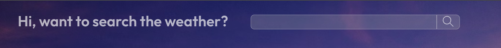
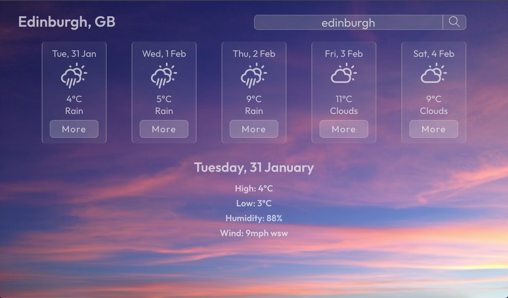

# Weather App

This is a weather app built using react.js. It is part of the front end module at [Command Shift](https://www.commandshift.co/).

The first thing you should see is this search bar. Try searching for a place in the UK!


This is how the app displays the forecast for the searched location:



## API 
This app uses the [Weather API](https://cmd-shift-weather-app.onrender.com/) from [Command Shift](https://www.commandshift.co/).

## How to use
Eventually I will get round to deploying this app.
For now, or if you want to mess around with the inner workings:

### Clone repo
```bash
git clone https://github.com/George-xixi/weather-app
```

### Install dependencies
```bash
npm i
```
### Launch app locally
```bash
npm start
```

### To run tests 
```bash
npm test
```


## Thanks

-Thanks to [Yan](https://github.com/yan-fung) and [Carlos](https://github.com/C-Marfil) for helping me troubleshoot (and copy a little).
-Thanks to all the tutors at [Command Shift](https://www.commandshift.co/)!
-Thanks to [Unsplash](https://unsplash.com/) for the beautiful images.

### George - 2023